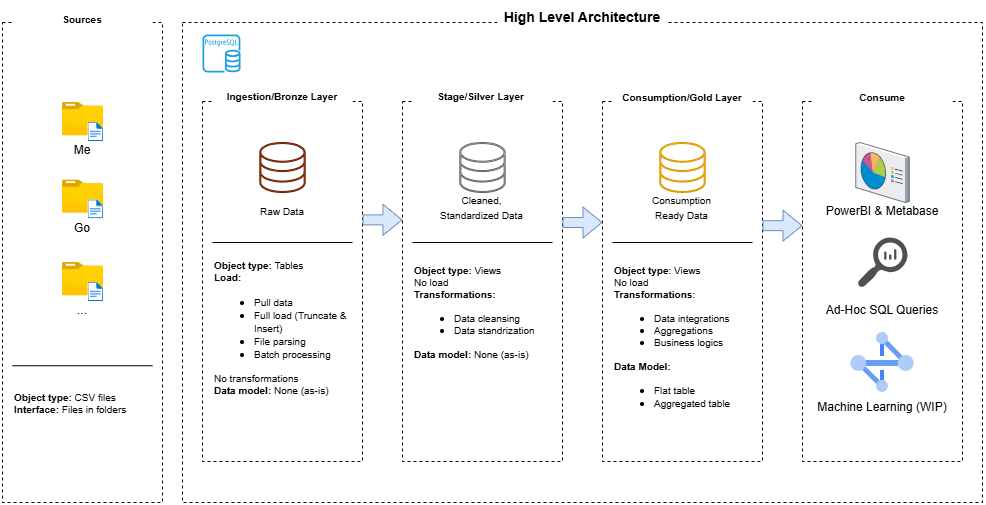

# SQL and Python Project - Finance

This project demonstrates a sql and python solution focused on data engineering, from a work in progress data warehouse to generating factionable insights. Designed as a portfolio project, it highlights industry best practices in data engineering and analytics.

---

## Data Architecture

The data architecture for this project follows Medallion Architecture **Bronze**, **Silver**, and **Gold** layers:


1. **Ingestion/Bronze Layer**: Stores raw data as-is from the source systems. Data is ingested from CSV Files into Postgre Database.
2. **Stage/Silver Layer**: This layer includes data cleansing, standardization and processes to prepare data for analysis.
3. **Consumption/Gold Layer**: Tables ready for reporting and analytics.

---
## Project Overview

This project involves:

1. **(WIP) - Data Architecture**: Designing a Modern Data Warehouse Using Medallion Architecture **Bronze**, **Silver**, and **Gold** layers.
2. **(WIP) - ETL Pipelines**: Extracting, transforming, and loading data from source systems into the warehouse.
3. **(WIP) - Data Modeling**: Developing fact and dimension tables optimized for analytical queries.
4. **(WIP) - Analytics & Reporting**: Creating SQL-based reports and dashboards for actionable insights.

This repository is a portfolio project that showcase expertise in:
- SQL Development
- Data Architect
- Data Engineering  
- ETL Pipeline Developer  
- Data Modeling  
- Data Analytics  
- Machine Learning
---

## Project Requirements

### Building the Data Warehouse (Data Engineering)

#### Objective
Develop a modern data warehouse using Postgres to consolidate finance data, enabling analytical reporting and informed decisions.

#### Specifications
- **Data Sources**: Import data from CSV files and API (WIP).
- **Data Quality**: Cleanse and resolve data quality issues prior to analysis.
- **Integration**: Combine both sources into a single, user-friendly data model designed for analytical queries.
- **Scope**: Focus on the latest dataset only; historization of data is not required.
- **Documentation**: Provide clear documentation of the data model to support analytics.

---

### BI: Analytics & Reporting (Data Analysis)

#### Objective
Develop SQL-based analytics to deliver detailed insights into:
- **Expenses**
- **Savings**

These insights provide key metrics enabling assertive decisions.  

For more details, refer to [docs/notes.md](docs/notes.md).

## Repository Structure
```
python-finances/
│
├── compose/                            # (WIP) Yaml files with database and metabase container configs
│
├── docs/                               # (WIP) Project documentation and architecture details
│   ├── data_architecture.drawio        # Draw.io file shows the project's architecture
│   ├── glossary.md                     # Keyword abbreviation
│
├── python/                             # Python scripts to extract and load files
│   ├── etl/                            # Old ETL python code (to be EOL)
│   ├── ingest_files/                   # Script for ingest into database tables
│   ├── recreating_views/               # Scripts for recreate dependences on views
│
├── sql/                                # SQL scripts for transformations
│   ├── ingest_bronze/                  # Scripts for extracting and loading raw data
│   ├── stage_silver/                   # Scripts for cleaning and transforming data
│   ├── consumption_gold/               # Scripts for creating report analysis
│
├── .env                                # Environment variables
├── .gitignore                          # Files and directories to be ignored by Git
├── README.md                           # Project overview and instructions
└── requirements.txt                    # Dependencies and requirements for the project
```
---

## About Me

Hi there! I'm **Fabio**, a Data Engineer passionate about building solutions that involve Data and AI technologies.

Let's stay in touch! Feel free to connect with me on the following platforms:

[](https://www.linkedin.com/in/data-engineer-fabio-silva/)
[](https://data-engineer-fabio-silva.github.io/resume-data-engineer-fabio-silva/)